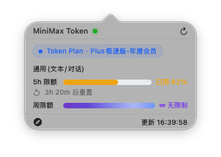
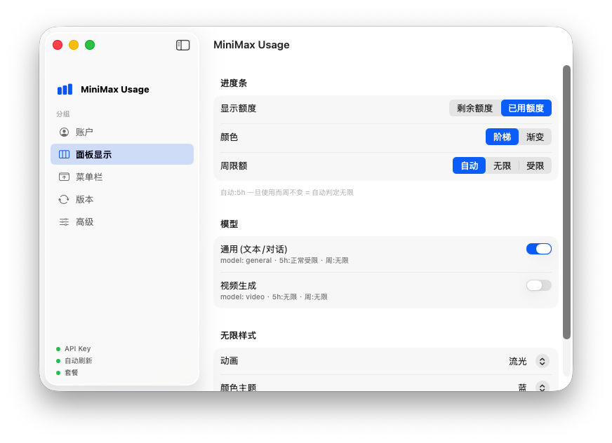

# MiniMax Usage

macOS 菜单栏里的 MiniMax Token Plan 额度监控工具。它会把当前套餐、5h 窗口额度、周额度和刷新状态放在菜单栏与轻量 popover 里，适合长期挂着看剩余额度。


## 截图





## 功能

- 菜单栏实时显示已用额度或剩余额度
- Popover 展示套餐、5h 窗口、周额度、重置时间和刷新时间
- 设置窗口支持账户、面板显示、菜单栏样式、版本更新和高级选项
- API Key 存入 macOS Keychain，不写入仓库或明文配置文件
- 支持 Sparkle 自动更新，发布版通过 GitHub Releases 分发
- 适配深浅色菜单栏图标和彩色状态显示

## 安装

到 [Releases](https://github.com/Gokady/MiniMaxBar/releases) 下载最新版：

| 文件 | 用途 |
| --- | --- |
| `MiniMaxBar.dmg` | 推荐，拖到 Applications 安装 |
| `MiniMaxBar.zip` | Sparkle 自动更新与手动解压安装 |

首次打开如果 macOS 提示无法验证开发者，请在 Finder 中右键 `MiniMaxBar.app`，选择“打开”，再确认一次。之后可以正常启动。

## 使用

1. 启动 `MiniMaxBar.app`
2. 点击菜单栏图标，进入设置
3. 在“账户”里填入 MiniMax Token Plan API Key
4. 保存后回到菜单栏查看额度

## 更新

应用内“版本”页面可以手动检查更新。开启自动更新后，Sparkle 会按固定周期检查 GitHub Releases 里的 `appcast.xml`，下载并验证签名后的新版本。

## 隐私

- API Key 只保存在本机 Keychain
- 请求只发往 MiniMax Token Plan 接口
- 仓库不包含用户密钥、私钥或本地数据库

## 开发

```bash
./build.sh release
open dist/MiniMaxBar.app
```

项目使用 SwiftPM 构建。发布流程在 GitHub Actions 的 `Manual Release` workflow 中执行，会生成 `MiniMaxBar.zip`、`MiniMaxBar.dmg` 和 Sparkle `appcast.xml`。

发布 Sparkle 更新需要在仓库 Secrets 中配置：

```text
SPARKLE_PRIVATE_KEY
```

## License

MIT © 2026 Goka
